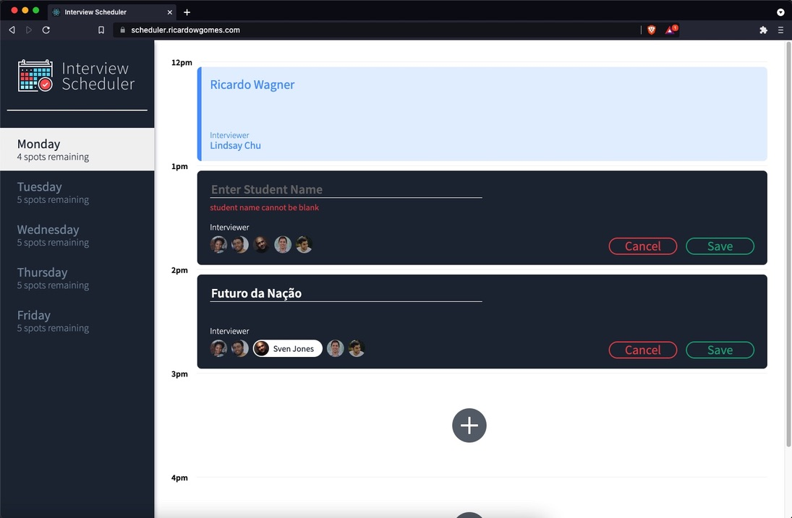

# Interview Scheduler

- [About](#about)
- [Final product](#final-product)
- [Installation](#installation)
- [Usage](#usage)
- [Testing](#testing)
- [Deployed app](#deployed-app)
- [Dependencies](#dependencies)
- [Development dependencies](#development-dependencies)

---

## About

The **Interview Scheduler** is a single page app built with [React](https://reactjs.org/) that allows a user to book an appointment with an interviewer.
The deployed app is available at: https://scheduler.ricardowgomes.com/

---

## Final product

#### View of the project



---

## Installation

Clone the repository:

```shell
git clone git@github.com:ricardowgomes/scheduler.git
```

Install all the dependencies::

```shell
npm install
```
or
```shell
yarn install
```

The app also requires the [Interview Scheduler API](https://github.com/ricardowgomes/scheduler-api) to be installed separately, and a [PostgreSQL](https://www.postgresql.org/) database set up and running. Instructions are provided in the Scheduler API [README](https://github.com/ricardowgomes/scheduler-api#readme).

---

## Usage

Start the Interview Scheduler API (from the corresponding repository, not this one):

```shell
npm start
```

Start the [Webpack](https://webpack.js.org/) development server (from **this** repository):

```shell
npm start
```

The development server will automatically open a browser at `http://localhost:8000/` with the app running.

---

## Testing

The project takes advantage of multiple testing frameworks:

- Static testing with the [prop-types](https://www.npmjs.com/package/prop-types) package.
- Unit testing with [Storybook](https://storybook.js.org/).
- Unit testing and integration testing with [Jest](https://jestjs.io/) and the [Testing library](https://testing-library.com/).
- End to end testing with [Cypress](https://www.cypress.io/).

#### To run Storybook

```shell
npm run storybook
```

#### To run Jest

```shell
npm test
```

A coverage report can also be generated with:

```shell
npm test -- --coverage --watchAll=false
```

#### To run Cypress

The project was developed with Cypress installed globally. Thus running Cypress for the project first requires:

```shell
npm i -g cypress
```

Make sure that the Scheduler API server is running in **test** mode. The tests will not work if the API server is running in development mode. Then:

```shell
npm run cypress
```

---

## Deployed app

The app has been deployed on **Netlify**, with the Scheduler API deployed on **Heroku**.

The deployed app is available at: https://scheduler.ricardowgomes.com/

Please note that it can take a moment for the API to start up on Heroku and serve the appointments.

Continuous integration to automate testing and deployment is set up through [CircleCI](https://circleci.com/):


---

## Dependencies

- [React](https://reactjs.org/)
- [axios](https://www.npmjs.com/package/axios)
- [classnames](https://www.npmjs.com/package/classnames)
- [normalize](https://www.npmjs.com/package/normalize)

---

## Development dependencies

- [Babel](https://babeljs.io/)
- [Storybook](https://storybook.js.org/)
- [Testing library](https://testing-library.com/)
- [node-sass](https://www.npmjs.com/package/node-sass)
- [prop-types](https://www.npmjs.com/package/prop-types)
- [react-test-renderer](https://reactjs.org/docs/test-renderer.html)